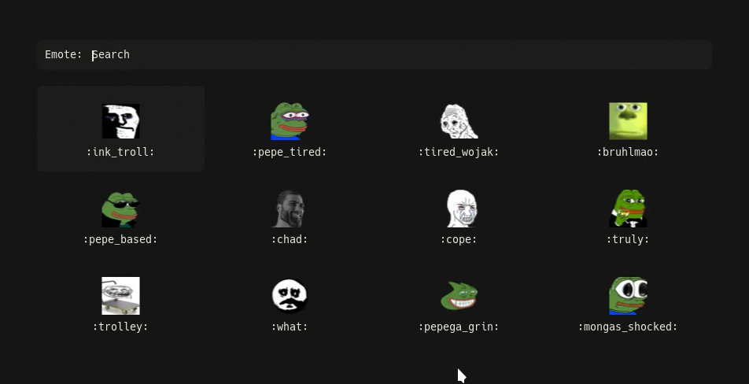

# Discord emote menu

A bash script, for those of us who don't have nitro, that lets you use Discord emotes from any of your servers. It opens a rofi menu with all the emotes from your servers and automatically sends the selected emote to the discord window using a link. Frequency based ordering is also implemented.



## Setup

The first time you run this script, it will download all the emotes in advance. To do this, an API token is required. [Here's](https://discordhelp.net/discord-token) a quick guide that tells you how to obtain your token.

If you are in too many servers or would only like to fetch emotes from certain servers, run the script with the `-f` option with the server IDs in a single string, space delimited. Example:

```
./emote.sh -f "917437910914064405 673500631322853377"
```

## Dependencies

This script depends on a few other utilities:

- `jq` - Parses json response from Discord API
- `imagemagick` - For resizing emotes to regular size
- `rofi` - For displaying the emote menu
- `xdotool` - Sending input to windows
- `xclip` - Clipboard management

## Usage

```
Usage: emote.sh [OPTION...]
A script to open a discord emote menu

Options:
-w, --window-class [class]         Window class to send the emote to. Set to "Discord" by default
-r, --rofi-config  [file]          Specify a custom config file for the rofi menu
-f, --fetch-emotes [servers]       Download emotes. Optionally specify a server ID list seperated by a space and enclosed in quotes. Example: "234113424342 092432714749"
-c, --colon                        Display colon at the beginning and end of emote name.
-p, --paste-url                    Paste url instead of uploading file
-h, --help                         Display this help menu
```

### Starting

To run this script with colons and the provided sample Rofi config file in the demo:

```
./emote.sh -c -r sample.rofi
```

### Updating emote collection

Adding or removing emotes can be done on Discord in server settings. You can update the local collection using the `-f` option described earlier, since it only downloads any new emotes that previously did not exist.

### Other platforms

Technically, this script is suited to work with almost any application where images can be uploaded through pasting with `Ctrl-V` and `Enter`.
The only parameter to tweak for that would be `-w` to set the window class, which can be fetched with `xprop`.

## Contributions

All contributions in the form of PRs, bug reports, feature requests, etc are gladly appreciated.

## Credits

Credits to [yuky2020](https://github.com/yuky2020) for the Rofi theme from [this](https://github.com/yuky2020/rofi-themes) repository.
